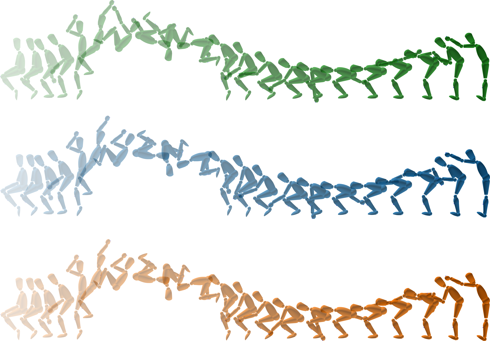

# Introduction
This repository contains the code generating the optimal control problems (OCP), 
the analyze of the data experimental and the results of the article entitled “Including limb-on-limb holonomic constraints
in predictive simulation allows replicating athlete’s backflip technique”. 
The predictive simulation computes the optimal backflip techniques with and without a holonomic constraint. 
This holonomic constraint enables the avatar to use its hand to pull its shanks during the tuck phase. 
The goal is to compare the optimal kinematics in both scenarios and demonstrate that predictive simulations incorporating holonomic constraints produce more realistic and accurate representations of an athlete’s backflip technique.



# Cite this work
```bibtex
@article{Farr2025,
title = {Including limb-on-limb holonomic constraints in predictive simulation allows replicating athlete’s backflip technique},
journal = {submitted to Multibody System Dynamics},
volume = {},
pages = {},
year = {2025},
issn = {},
doi = {},
url = {},
author = {A. Farr, E. Charbonneau, M. Begon and P. Puchaud},
keywords = {Holonomic constraint, Constraint dynamics, Predictive simulation, Optimal control, Biomechanics, Gymnastics, Closed-loop}
```

# Status
| Type | Status |
|---|---|
| Zenodo  |  |

# How to install dependencies
In order to run the code, you need to install the following packages from [pyomeca]( https://github.com/pyomeca):
```bash
conda install -c conda-forge biorbd=1.11.1 python-graphviz matplotlib numpy scipy pyorerun bioviz=2.3.2
```

# Installing Bioptim from source
1. Clone the repository:
   ```bash
   git clone https://github.com/Ipuch/bioptim.git
   cd bioptim
   git checkout ReleasePaperBackTuck
   ``` 
2. Install the library:
   ```bash
   python setup.py install
   ```
# Setting Linear Solver for Ipopt
To enhance optimization, configure the linear solver (e.g., `ma57`) in your script:
```python
from bioptim import Solver
solver = Solver.IPOPT()
solver.set_linear_solver("ma57")
```
Otherwise, use mumps, but you won't replicate the results.

# Exemples
In the folder `examples\`, you will find the following examples (NTC, KTC, HTC):
- `sommersault_5phases_CL_with_pelvis_landing.py`: This script generates the optimal control problem with the holonomic constraint.
- `sommersault_5phases_CL_with_pelvis_landing_tau_dot.py`: This script generates the optimal control problem with the holonomic constraint and torque derivative driven
- `sommersault_5phases_KTC_with_pelvis_landing_tau_dot.py`: This script generates the optimal control problem with the kinematic constraint and torque derivative driven
- `sommersault_5phases_with_pelvis_landing.py`: This script generates the optimal control problem without the holonomic constraint.
- `sommersault_5phases_with_pelvis_landing_tau_dot.py`: This script generates the optimal control problem without the holonomic constraint and torque derivative driven 
 

# Contents from the paper
In predictive simulations of human movements, contact interactions between limbs are often neglected to reduce modeling complexity. However, limb-on-limb contacts are inherent to certain movements, such as the backward tuck somersault where athletes grasp their legs with their hands while rotating in the air. 

In the present study, we introduced limb-on-limb holonomic constraints into an optimal control problem to simulate more realistic techniques of backward tuck somersault. It was simulated using a planar digital twin comprising eight degrees of freedom and was divided into five phases: propulsion, pre-tuck flight, tuck, post-tuck flight, and landing. We modeled the limb-on-limb interaction during the tuck phase in two ways: 
- with holonomic tucking constraints allowing force generation between the hands and shank
- with kinematic tucking constraints only prescribing the hand position, without force generation. Incorporating the holonomic tucking constraint allowed the avatar to pull its shanks using its hands, replicating the behavior measured in an athlete. 

This pulling strategy reduced the hip joint torques and the metabolic energy expenditure required to counteract the centrifugal pseudo-forces during the somersault rotation, leading to a more efficient movement. These findings suggest that incorporating limb-on-limb holonomic constraints enhances the biomechanical accuracy and realism of simulated human movements. Our implementation of limb-on-limb holonomic constraints can be utilized in other simulation contexts, potentially advancing the modeling of complex human motions in sports science, rehabilitation, and robotics.
