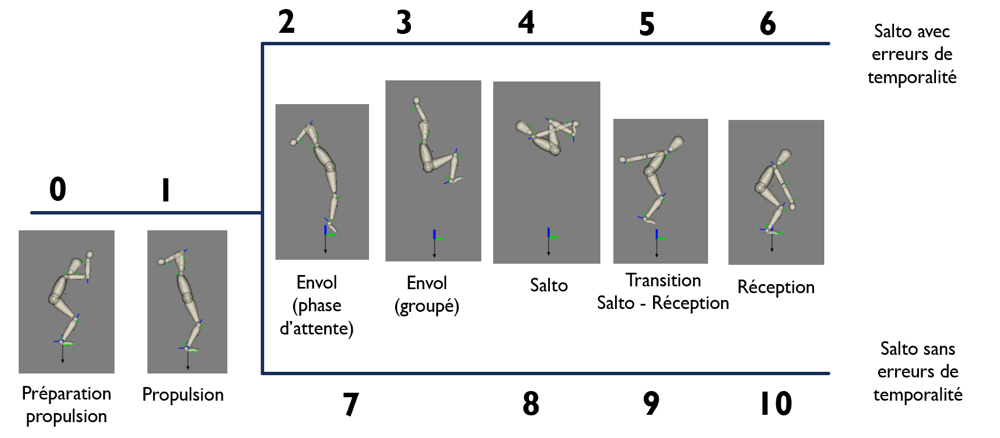

# Robust_standingBack
This repo aims to generate robust techniques for a standing back somersault on ground.

## Steps
### 2D model
Create model 2D from 3D model with the file `GeneratePlanarModel.py` in the folder ([`code_salto.py`](https://github.com/AnaisFarr/Robust_standingBack/blob/main/code_salto))

### Generate jump, salto (3, 4, 5 and 6 phases) and salto with actuator
All jump and salto simulations can be found in the folder: ([`code_salto.py`](https://github.com/AnaisFarr/Robust_standingBack/blob/main/code_salto))

In first, I create codes to generate simple jump in two ([`Salto_2phases.py`](https://github.com/AnaisFarr/Robust_standingBack/blob/main/code_salto/Jump_2phases.py)) and 
three phases([`Salto_3phases.py`](https://github.com/AnaisFarr/Robust_standingBack/blob/main/code_salto/Jump_3phases.py)) in order to learn how to use bioptim.

The second step was to add a backward somersault during the flight phase, when the model attain the maximal height of 
his centre of mass (CoM). I begin by implement a backward somersault in a 3 phases movement ([`Salto_3phases.py`](https://github.com/AnaisFarr/Robust_standingBack/blob/main/code_salto/Salto_3phases.py)) 
and gradually I increase the number of phases until reach 7 phases([`Salto_7phases.py`](https://github.com/AnaisFarr/Robust_standingBack/blob/main/code_salto/Salto_7phases.py)).

We also tried to simulate a backward salto with actuator dynamics ([`Salto_actuator.py`](https://github.com/AnaisFarr/Robust_standingBack/blob/main/code_salto/Salto_actuator.py)).

### Robustness
After this, we want a code who produce two different techniques of backward somersault ([`Dedoublement_phase.py`](https://github.com/AnaisFarr/Robust_standingBack/blob/main/code_salto/Dedoublement_phase.py)): 
one in 6 phases and an other with a waiting phase (i.e. phase 2) between the propulsion phase and the take-of phase.
These two methods have the same results for the preparation of propulsion and the propulsion phase.

### Closed-loop during the tucked phase
We also tried to simulate a backward salto with a closed-loop during the tucked phase, 
all these simulations can be found in the folder: ([`holonomic_research`](https://github.com/AnaisFarr/Robust_standingBack/tree/ocp1/holonomic_research)). 
Several salto with and without floating base and with a certain number of phases were simulated up to 6 phases
([`Salto_6phases_CL.py](https://github.com/AnaisFarr/Robust_standingBack/blob/ocp1/holonomic_research/Salto_6phases_CL.py)). 
However, the 6-phase salto is not yet complete, as the landing is too rigid.

We list all the results of the simulation of jump and salto (simple, actuator, robustness and closed-loop) into a [Google Sheets](
https://docs.google.com/spreadsheets/d/1Zcdg7ftSXRW_HKXzb-tU153mgNU3cz4pQy1RCIJ5Snk/edit?usp=sharing).

## Model
The different model use are in the folder "Model". 
The name of the model is defines like this: `"Model2D_8Dof_2C_3M"` according to the type of the model (i.e. 2D or 3D), the number of degree of freedom (i.e. Dof) 
the number of contact (i.e. C) and the number of markers (i.e. M).

## How to save and visualize data

To save data, we use a function save_results_with_pickle, from the [Save file](https://github.com/AnaisFarr/Robust_standingBack/blob/main/code_salto/Save.py), who use pickle to save all parameters (states, states dot, controls, cost, objectives, contraints).
There are different codes for saving data depending on the nature of the salto (with or without a closed-loop during the grouping phase) 
because the variables (i.e. q and qdot) do not have the same name with a closed-loop (i.e. q_u and qdot_u).

To visualize data, we use the file [Visualisation](https://github.com/AnaisFarr/Robust_standingBack/blob/main/code_salto/visualisation.py).
There are different codes to visualize the simulation according to the nature of the movement (i.e. with or without closed-loop) 
and according to the number of phases (from 1 to 6).
